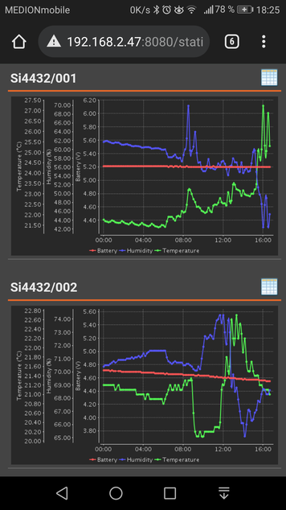
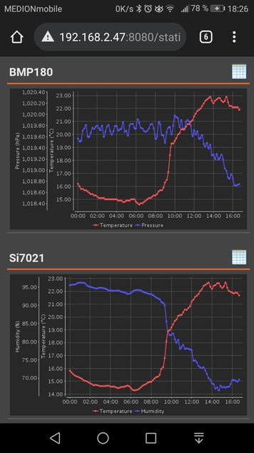

# ambient-sensors-webapp

A simple Java WEB Application to visualize the content of the sensor log files.

## Preview

## Configuration

Can be done in `station.xml`

## Build

Run `build.xml` as ANT script.
Deploy the `dist/ROOT.war` on Tomcat.
